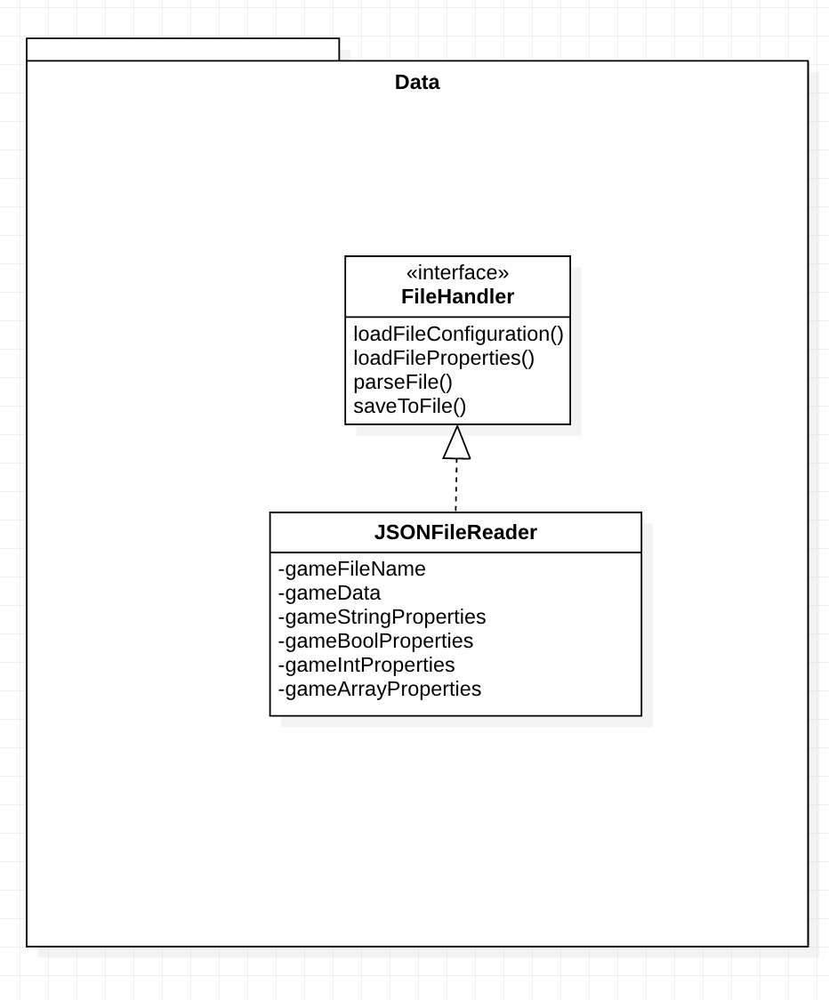
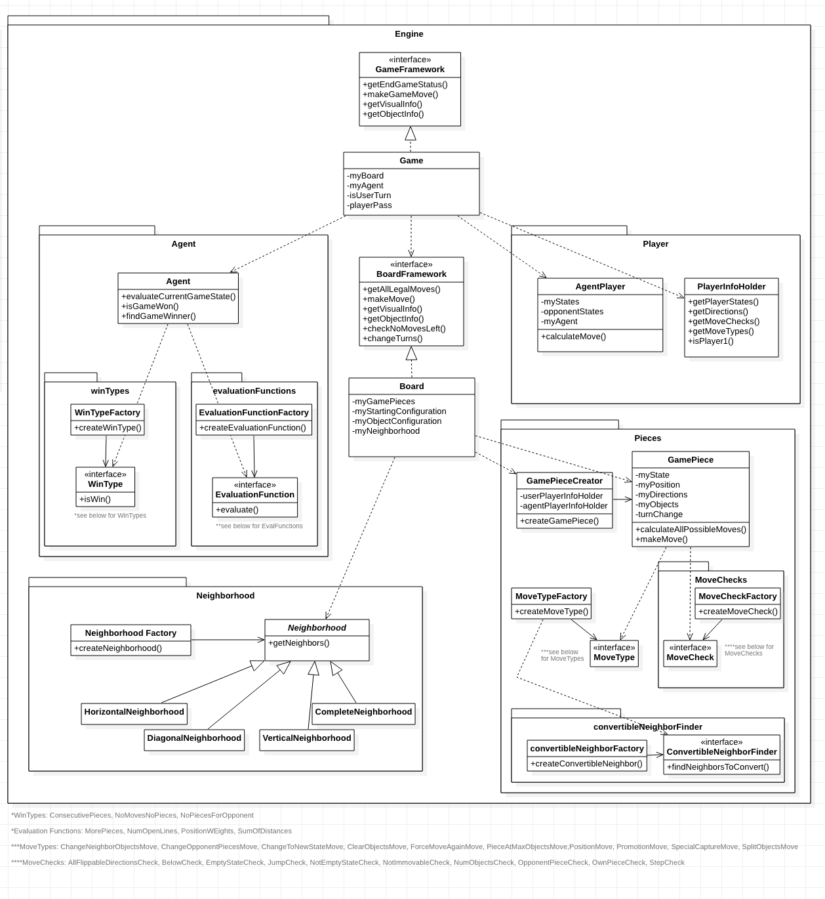
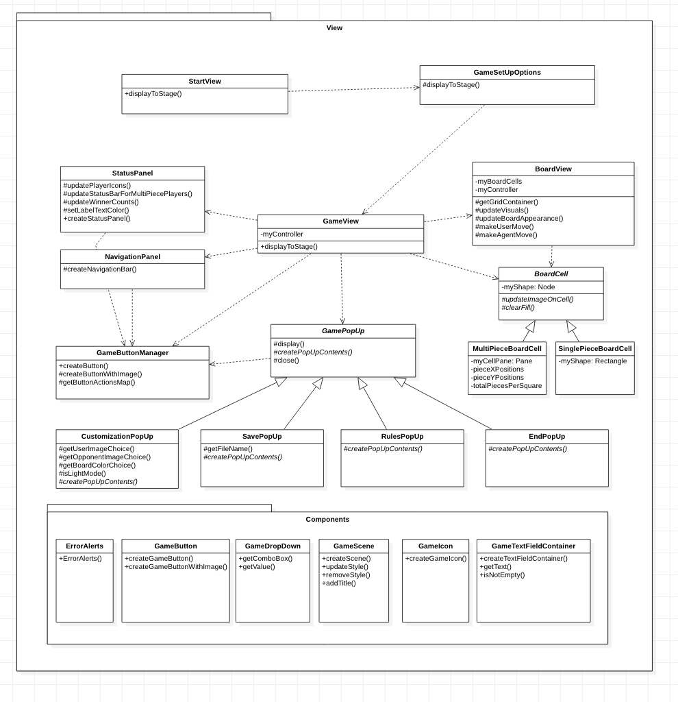
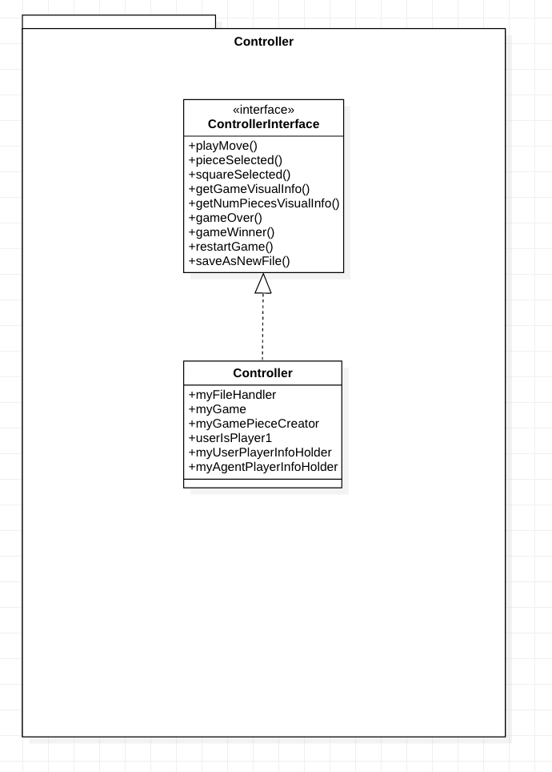

* names of all people who worked on the project
    * Sanya Kochhar (sk489)
    * Brian Li (bl195)
    * Holly Ansel (haa20)
    * Jessica Su (js803)
* each person's role in developing the project 
    * Jessica - developer 
        * Back-end responsibilities 
            * Created the basis of the Game/Board frameworks 
            * Implemented the evaluation functions & moves required to run an Othello game 
        * Front-end responsibilities 
            * Made the CustomizationView to customize player images, board colors, and switch to dark/light mode 
            * Allowed board cells to hold multiple piece images 
    * Holly - developer
        * Back-end responsibilities
            * Created the Agent Player
            * Established the Agent Hierarchy
            * Implemented the evaluation functions/win types & moves required to run a Checkers Game
            * Implemented the evaluation functions/win type required to run for a Tic-Tac-Toe game
            * Implemented the moves required to run a Mancala game
        * Front-end responsibilities
            * Created the Start View
    * Brian - developer 
        * Back-end responsibilities
            * Created and implemented JSONFileReader
            * Implemented the evaluation functions & moves required for TicTacToe and Connect4
        * Front-end responsibilities
            * Implemented GameView (Button functionality, board, and save file)
            * Implemented PopUps class for button functionality
    * Sanya - developer
        * Back-end responsibilities
            * Created the basis of the Controller and GamePiece frameworks
            * Implemented the agent evaluations for Mancala, Chopsticks and Othello
            * Implemented the moves required for Mancala and Chopsticks game pieces
            * Implemented game restart functionality
        * Front-end responsibilities
            * Implemented GameSetupOptions for changing board dimensions and playing as player 1 or player 2 after selecting a game
            * Implemented EndViewPopUp (display win status, play again, return to setup and return to menu when the game ends)
* what are the project's design goals, specifically what kinds of new features did you want to make easy to add
    * Design goals: 
        * The primary design goal of this project was to use data-driven design to be able to support a variety of strategy games. We wanted to make our code flexible enough so that a user could specify all the front-end and back-end components required to run a game solely from the JSON configuration file. 
        * In order to accomplish this, we eliminated game-specific classes and instead had general move types, move checks, evaluation functions, and win types to support the differences in game logic. 
        * The visual and configuration information was also only contained in the JSON game files, which we used to allow users to initialize a game with a certain starting configuration and then customize certain game features (ex. How pieces are represented) as they played the games. 
    * Easy-to-add features: 
        * Because everything is specified in the config file, the following features of games are easy to modify: 
        * Game logic (ex. How a move is made, how a win is determined)
            * Can be changed through different combinations of move checks, move types, evaluation functions, or win types. 
        * Front-end images/colors used to represent game pieces
        * Dimensions of the board run the game from
        * Initial configuration of the board (where each player’s pieces should start on the screen, how many pieces each position should hold) 
* describe the high-level design of your project, focusing on the purpose and interaction of the core classes 
    * The overall design of our project was composed by using the MVC framework to separate the logic of the front and back end, and the specific components will be described more in depth below. Another influential component of the design is that it is data driven, and therefore pulls a lot of information from data files and has no classes for game specific logic but rather combines different objects to create the specific functionalities.
    * Controller
        * The main purpose of the controller is to communicate between the various modules of the program. The controller uses the file handler to parse and get specific values from the data files, and some of these values are passed to the view while others are passed to the model. The controller also calls on the engine to perform actions and then get information to pass to the view to represent the current game state visually.
    * View
        * Starting views
            * When the program opens the initial starting screens, the StartView and GameSetupOptionsView serve to allow the user to specify the file and specific details they want in starting a game. The StartView is where the user specifies (either through a button, the dropdown, or the textfield) what file they want to run for the program. And then the GameSetupOptionsView allows the user to choose options related to the game they have selected such as whether they want to be player 1 or player 2 and choose the board size.
        * Game View 
            * The GameView creates the GUI for the game board along with the navigation buttons (play move, return to menu, restart, and save progress), top buttons (rules, customization), and status panel reflecting the wins/losses. This is where the information from the back end is displayed and the user also has flexibility to influence the look of the game they are playing. Different values from the data files allow for different experiences in the game view such as being able to move versus place a piece or if within a piece there are multiple objects. The various buttons allow the user to do different things such as restart the game, play the same game with different setup options, go back to the main menu, see the game rules, and save the current game state to a file. The make move button is where the view calls on the controller to call on the engine to do the logic for completing a turn.
    * Model
        * Data → handles the data files
            * The FileHandler is responsible for directly parsing JSON files and retrieving initial configurations and view properties as well as saving a current game configuration to a JSON file. Additionally, it validates the data to make sure the appropriate types are given, all the information needed is specified, and values that need to match do.
        * Engine → handles the game logic
            * Game 
                * The game class is mainly responsible for calling on all of the different game components to act such as the board, the agent, and the agent player. The game class controls the turn logic of the game to see if the turn changes after a player moves or if the turn is a pass. Depending on whose turn it is, the game class calls on the appropriate sequence of actions for that player (agent or user) to make a move on the board. Additionally the game evaluates the overall status of the game to see if the game is over or still continuing. To do so, it calls on the board to see if there are still moves available and the agent to see if the game has been won by a player. The game then makes the updated overall status, such as the board configuration, object configuration, if the game is over, and who the game winner is, available for the controller to get.
            * Board
                * The board class is responsible for managing all of the game pieces. It uses the initial configuration information provided along with other information such as all of the neighborhood types to create and arrange all of the game pieces. The board is also responsible for getting all of the legal moves for a player, which is used both by the Agent Player in order for it to determine its move and for the board to see if either of the player has any legal moves (which influences whether the game is over or not). The board additionally makes the moves specified by a player by calling on a game piece to validate and then make the move. Furthermore, the board can create copies of itself and provide its information in an encapsulated format as a data structure that only reveals the necessary information.
            * Game Piece
                * The game piece is created to contain self move checks, neighbor move checks, move types, and internal information such as its state, position, number of objects, and direction. The game piece’s main function is to find all of the legal moves it can make based on iterating through all of the neighbors the board provides it and performing the specified move checks on itself and its neighbor. The game piece additionally can be called upon to make a move, which involves enacting all of its move types. Finally, the game piece can give parts of its information such as its state, position, and number of objects as well as make a copy of itself, which is a game piece containing all of the same information.
                * Multiple move checks and move types can be combined to create more complex piece movements.
                * Move Checks
                    * Move checks are done on a game piece, and the game piece can call a move check to perform on itself or on its neighbor. The move checks serve to see if a particular move would meet the necessary conditions. Certain move checks only look to see if the state is correct, others check the number of objects, and some check a combination by looking at positions and states of multiple neighbors.
                * Move Types
                    * Move types are done by the game piece to influence the state, position, number of objects, and direction of a piece as well as if the turn should change afterwards. Some move checks additionally influence the state, position, and number of objects of a piece’s neighbors. 
                    * Convertible Neighbor Finder
                        * For move types that influence the state, position, and number of objects of its neighbors, the move types will use a ConvertibleNeighborFinder. The convertible neighbor finder is responsible for finding which neighbors will be converted/changed.
            * Player Information Holder
                * The player information holder, as the name implies, stores information associated with a player such as the states that represent that player, the direction that player moves in, and the self and neighbor move checks that player performs as well as the move types. The move checks and move types use player specific information, which is why they belong to a player.
            * Agent
                * The agent provides the knowledge of the overall game state. It allows for its smart knowledge to be used by the agent player to make moves and by the game to see if the game has been won.
                * Evaluation Functions
                    * Many evaluation functions can be combined for the agent to evaluate the current game state. The evaluation functions use different forms of estimates in order to determine how good/bad the current game state is for the max or min player.
                * Win types
                    * The win type is how the agent calculates if the game has been won and if so who the winner is. The different win types may look for a particular board configuration or having more pieces than another player.
            * Agent Player
                * The  agent player uses information about its states and its opponent states to determine the move the agent player will make. The agent player will use a copy of the board to test out moves for itself and its opponent and call on the agent to evaluate which move is the best for it to make.
            * Neighborhood
                * The neighborhood, depending on its type, will use the coordinate it is finding the neighbors for and the board size to give a list of all the coordinates that are neighbors to the coordinate provided. 
            * Coordinate → succinctly stores coordinate information coupled together in a way that is uniform across the program

    * Here are some UML diagrams to visualize the design
        * NOTE ABOUT DIAGRAMS: not all methods are present (that would be way too many); instead, we’ve included the  most important ones to highlight each class’s/interface’s responsibilities 
        * MODEL: 
            * 
        * MODEL (CONTINUED): 
            * 
        * VIEW: 
            * 
        * CONTROLLER: 
            * 

* what assumptions or decisions were made to simplify your project's design, especially those that affected adding required features
    * The game will always be for two players. 
    * All pieces in a particular game share basic functionality (i.e. our game does not support games like chess, where there are 6 types of pieces with varying functionality but does support games like checkers and mancala where there are 2 different types of pieces with similar functionality).
    * Users can only play against a computer AI player and not against another human player.
    * The game space is a board and the board does not move
    * Players take turns to play, i.e., they never make moves simultaneously

* describe, in detail, how to add new features to your project, especially ones you were not able to complete by the deadline
    * Customizing games:
        * The data-driven design allows for a lot of customization by simply changing details in the game’s data files such as changing the default game piece images, the board size and starting configuration, the AI evaluation functions to be used, etc. New data files can be added to include these customizations or a game in progress can be saved once these preferences have been made using the setup and customizations screens.
	* Adding a new game extension:
        * A new game can be directly loaded from a custom configuration file and played using the load game option on the start screen.
            * The game’s data file indicates the game-specific details such as the neighborhood type, win types, self move checks, neighbor move checks and move types to be used, so these can be specified in the data file without requiring any new code to use the commonly occurring strategy game evaluations already created. For ones that are given in a list format in the data file (such as neighborhood type, self move checks, neighbor move checks, move types, and evaluation functions) many can be provided in order to create more complex games.
                * To customize evaluations, new MoveTypes, evaluation functions, convertible neighbor finders, MoveChecks, etc. can be created.
        * Alternatively, to permanently add the game to the selections available in the main menu:
            * Update the GameCenterView.json to include the title, game icon, description and default data file of the new game description and image
            * Add a new default json file for the game following the format of the existing games, as indicated in the attached doc GameFileFormat
            * If new images are required for game components such as pieces, they must be added to the /resources/images folder
        * If you wanted to add a game that has some sort of functionality that is not already supported the program can easily be extended to accommodate new functionality. For whatever you are implementing, for example a move type, you just need to create a class that implements the interface for whatever it is and then add it to the factory for that interface (ex: MoveTypeFactory). Then you will be able to list it in your data file.

    * Although we did add all the necessary features for the project given our team size, we did put additional features in our plan that we did not get to accomplish. However our program does make these features relatively each to add so we will describe how they would have been added below.
	    * Adding a player profile pop up:
            * Front-end:
                * Create a new popup that extends GamePopUp
                * Add a new button in StartView to launch the popup
                * This popup should read win and loss values from each game stored in a data file and display the ratio of wins to losses
                * The program will additionally open with a login screen as opposed to the current start view (which features the menu for game selection). This will allow current users to sign in or a sign up button will allow a user to create an account. 
            * Back-end
                * Create a new data file in /resources to track high scores for each player. This can include a JSON object for each player (with their username as the ID to the object) and contains for each game including the number of wins and the number of losses
                * Add a playerFileHandler which uses similar logic to the JsonFileHandler except it gets and overwrites the win ratio for the player provided.
                    * When a game is won or lost, the endGame method in GameView should call the controller to tell the playerFileHandler to update the data file
                    * Logic would need to be added to the playerFileHandler to ensure that a user’s login info matches that of the file

