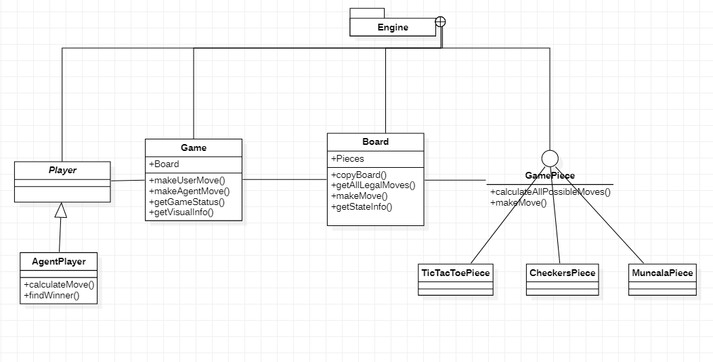
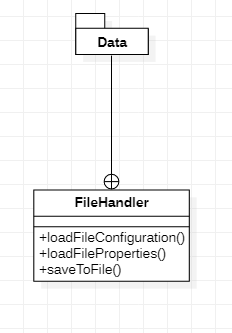
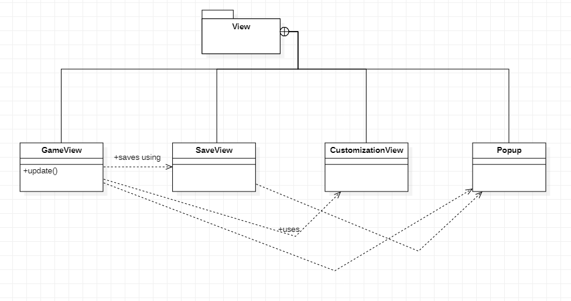
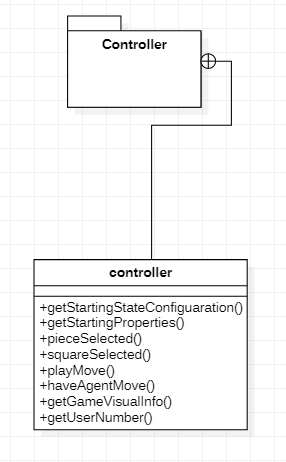

Design Plan
====
## Introduction
Our team is focused on building a program that supports a variety of two-player strategy games such as Tic Tac Toe, Connect 4 
and Muncala. The design is centered around supporting the existing games with closed game and board functionality, while 
its abstraction of game piece types makes it open to adding different types of strategy games. The game and board will be set up based on instructions from data files and be responsible for communicating updates to the controller, while the game specific pieces and players will dictate the game interactions and execute the updates. The user will be able to choose a game, load a previously saved game to continue and customize on-screen components such as the board and piece graphics. The view will be responsible for setting up GUI interactions and allowing the player to make a move which will then be communicated to the controller to tell the model what updates it needs to carry out. The opponent will run on AI based automation which will be open so that each game can have its own agent.  

## Overview
The program will be divided up into a number of modules as follows:
- **Model**
    - Game Engine
        - Game: an API responsible for holding the board and therefore keeping track of key gameplay information such as the winning status and player moves. Interacts with board and players to run the overall game. Passes lists of coordinates received either from the view (user case) or the agent to communicate piece moves on the board.
        - Board: API to hold all the game pieces and is responsible for changes in game piece states. Uses a Coordinate object to communicate moves.
        - Player: this abstract class will be used to create an agent player and potentially a user player, with a hierarchy to implement moves for each game.
        - Game Piece: an interface to be extended/implemented by each game to execute its particular game rules. It will be responsible for tracking a piece’s variables such as position, status and will help compute possible moves to be used by the agent player. 
    - File handler
        - This will read and parse the JSON files that provide game configuration details, piece states, board dimensions and other graphic features. It will provide functionality to SaveView to save the current game configuration.
- **View**
    - StartView:
        - Creates the start screen to allow users to select a game. Includes functionality to load a saved game configuration
        - Creates controller and passes it to GameView
    - GameView
        - API that dictates in-game interactions, including buttons such as “play move”, “main menu”, “save”, “restart”, “settings”, “help”
        - Settings will create a customization view for a user to change viewing preferences
        - Save button will defer to SaveView
    - SaveView
        - Will generate a dialog to allow a user to save to file
    - CustomizationView
        - Allows a user to update preferences such as change piece colors, board colors, etc.
- **Controller**
    - API to communicate between the view and the model. It will be communicating properties from the fileHandler to facilitate reactions on the view. Methods such as pieceSelected, squareSelected and playMove allow game piece movements occurring due to user input to occur on the backend. It tells the model when to generate an agent movement, and then communicates model reactions to the view.

These can be represented by the following UML diagrams:
- Overall module dependencies:

- Model components
    - Engine
    
    - Data
    - 
- View components
    
- Controller components
    

## Design Details
Further details on the components mentioned in the overview are as follows.

- **Model**
    - Game Engine
        - Game: this sub-module is responsible for holding the board and therefore keeping track of key gameplay information such as the winning status and the player turns. 
            - On setup, it is responsible for randomizing the assignment of the user and agent to player 1 or player 2. 
            - makeAgentMove/makeUserMove make calls to board.makeMove to tell the user and agent to make moves
            - getGameStatus will check if the game has reached a winning configuration
            - getVisualInfo queries the board for its current configuration to be communicated to the View by the Controller.
        - Board: this sub-module is initialized to particular dimensions based on information provided by the data files. It holds all the game pieces and includes methods to make a move that query the pieces: getAllLegalMoves, calculateNeighbors, makeMove, getAllStates 
            - getBoard returns a copy of the board to be used by the agent player for trying out potential moves
        - Player: this abstract class used to create an agent player and potentially a user player. 
            - The agent player will further have an abstract hierarchy to add an AI powered agent for each game that will calculate the opponents best move and find the winner.
            - CalculateMove uses minimax to calculate the best move for the agent to play
            - Special features implemented: artificial players
            - This will be useful in creating a second user-controlled human player as a special feature. It would require
            adding an Agent to keep track of win status since the AgentPlayer would not be used in this case.
        - Game Piece: an abstract class or interface to be extended/implemented by each game to execute its particular game rules. It will keep track of its current position and its state (as defined by data file), including which player it belongs to
            - calculateAllPossibleMoves(List <Neighbors>) will be used by the agent when it computes the best possible move it can make.
            - This is a key player in meeting the program’s design goals in that it supports the flexibility of the program to add new games without any of its core classes changing.
    - File handler
        - This will read and parse the JSON files that provide game configuration details as well as properties to set up the piece states, board dimensions and other graphic features. 
        - It will also be responsible for saving the current game configuration to file to allow users to be able to continue a game from a previous checkpoint.
        - Will use a JSON parsing API such as JSR 353 or Object Model API
    - The game engine and the file handler play a key role in maintaining the flexibility and abstraction necessary to align with the goals of our design. The player and piece hierarchies allow for new games to be added easily, with no change to the game and board. The file handler is able to process any additional details in the files to create new game types and pass that information along to the controller to be communicated to the view. 
- **View**
    - StartView
        - Will create the start screen to allow users to select a game. 
        - If a user wants to continue from a saved configuration, it will generate a dialog for them to enter a file name.
        - Once a game has been chosen, it will create a controller and pass it to GameView.
        - This will be adaptable to include high scores from previous games in a later sprint
        - Special features implemented: load game, high scores
    - GameView(Controller c)
        - This will dictate in-game interactions using a timeline to call on the controller to get updated states
        - Implements various buttons:
            - Play button: for when user finalizes their move
                - Calls controller.playMove(move information)
            - Main menu button: take back to start view
            - Save game button: defers to SaveView to save current game config to JSON
            - Restart game button: reloads model to starting configuration
            - Settings button: creates customization view for user to update preferences
            - Help (?) button: generates a How To Play pop up
        - Special features implemented: save game, load game, preferences
    - SaveView
        - Will generate a dialog to allow a user to save to file
        - Special features implemented: save game, load game
    - CustomizationView
        - Allows a user to update preferences such as change piece colors, board colors, etc.
        - Special features implemented: dark mode, preferences
    - Popup
        - Includes methods for creating custom button-activated popups (save, settings, help, invalidMove, Winner)
    - Additional viewing classes such as LoginView and ProfileView will be added to support player profiles
    - Bringing the above components into a module encapsulates the viewing components of the games to communicate with the controller rather than the model. These components are unchanging when it comes to adding in new games, allowing the view to gather the essential information needed from the data files but not have to execute any different code to use this new information.
- **Controller**
    - API to communicate between the view and the model. 
    - Methods described in the overview are key in allowing the front-end and back-end components to communicate between moves. Therefore, the controller provides information about user selections to the data and engine as well as the agent movements and game status to the front end. 
    - This is an important module to maintain encapsulation of the view and model from each other so that the model is not interacting with the front-end components.

## Example games
1. **Tic Tac Toe:** Tic Tac Toe relies on pieces being placed on a board to create a desired orientation of pieces, such as a horizontal/vertical/diagonal row. This is vastly different from games like Checkers where the end goal is to move existing board pieces to the end of the board by interacting with other game pieces. This functionality is supported by the hierarchy of agent players, where the Tic Tac Toe agent is responsible for calculating its specific best move so does not require any modification to the game or board to support
2. **Checkers:** Checkers differs significantly in that its pieces can change from being regular pieces to kings. While most of our games have only two piece types depending on ownership (player 1, player 2), these upgraded pieces require our piece design to keep track of additional subtypes. This will be supported by having the data files contain multiple components of information about each piece (i.e., Red, 0, x_pos, y_pos may denote a regular red piece, while Red, 1, x_pos, y_pos may denote a king). This change will be easy to include in the pieces themselves as well when this game is added, because the game pieces are abstract and specifically created for each game.
3. **Chopsticks:** Chopsticks is functionally different in that its basic premise is adding and removing game pieces that have no positional relevance in dictating their win status. It does not rely on a physical board but instead on its pieces. The customizations provided by its data files will be read in to make the board functionally present in terms of the code that supports it but not physically present on the screen by using colors and graphics effectively to mask it.

## Design Considerations
- *How to calculate specific neighbors for different games:* 
    - This consideration is one that has made us reconsider whether to keep the board common across all games or specific to each game. Each game has different requirements in terms of which neighbors it needs to know. For example, placing a piece in Checkers requires knowledge of all the adjacent pieces that piece could potentially skip over. Chopsticks needs to know the positions of all of its own pieces. The board has knowledge of all the piece positions, which would make it the likely candidate to provide this information, but it would also make our design less general. We have chosen not to include this method in the board because it would force us to create a board hierarchy.
- *How to pass board around to agents* 
    - It is necessary to pass the board to the agent player for the agent to be able to compute all possible moves and find the one it should play. It was clear that we must pass a copy of the board states for the agent to be able to try all moves without changing anything on the actual board. We had two options: first, to pass a board object and creating dependency between the player class and the board, therefore making it difficult to change the board in the future if we want to. Second, to pass a list of states to the agent, denoted by integers for each piece’s state, to allow the agent to reconstruct a similar structure to the board. We chose to use the board object despite the dependency because the second option would mean breaking encapsulation and revealing the internal data structure of the board. It would also require the agent to do grunt work to recreate a board-like structure or eventually end up creating a board object itself.
- *Move (by placing status on board) vs. move by moving existing piece to start and end position -- play move button:*
    - A “move” played in each game is quite different. For example, in Checkers, a move has an existing piece moving from a starting position to an ending position; in Connect 4, a move requires a new piece to be put down in an ending position. It was necessary to find a way to signal that a move had been played to the view, regardless of which game is being played. We have chosen to address this by including a “play move” button which the user has to press to signify that they are done making their move. This assures consistency in turn actions across all games by tying the “play” button to a turn. 

