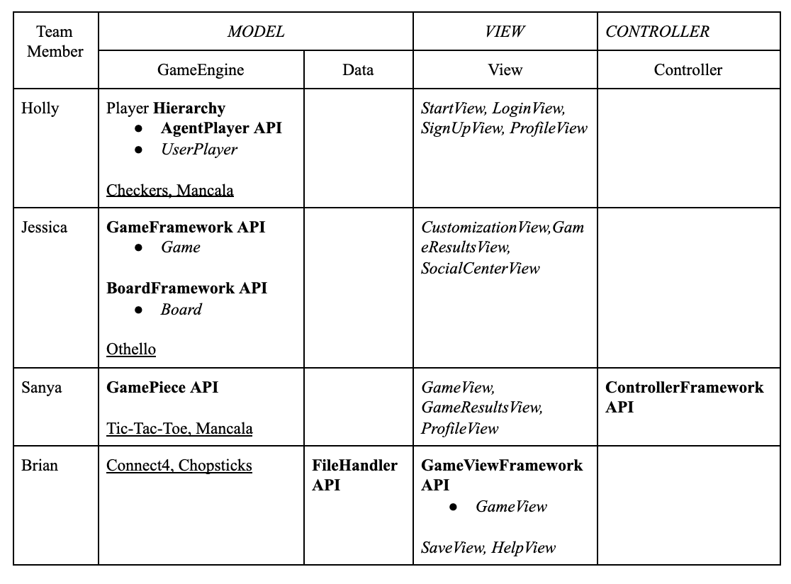
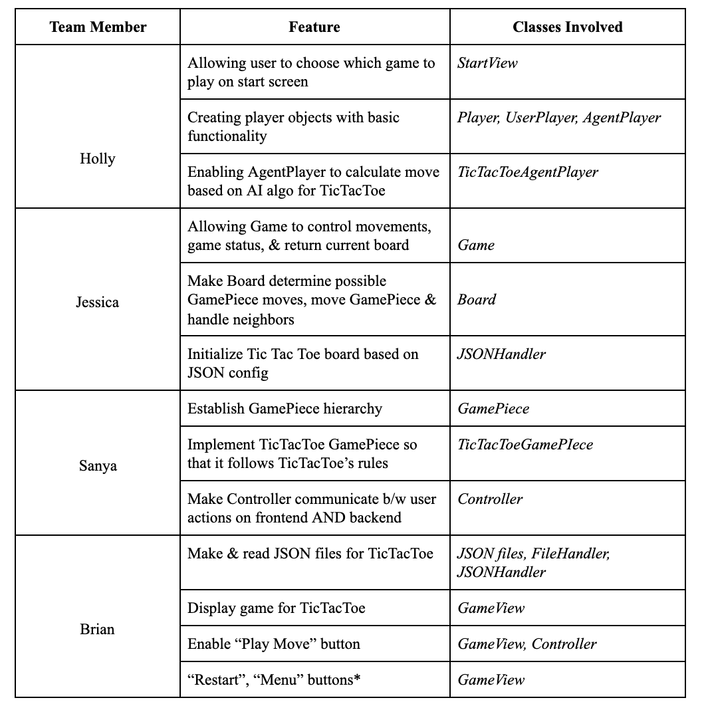
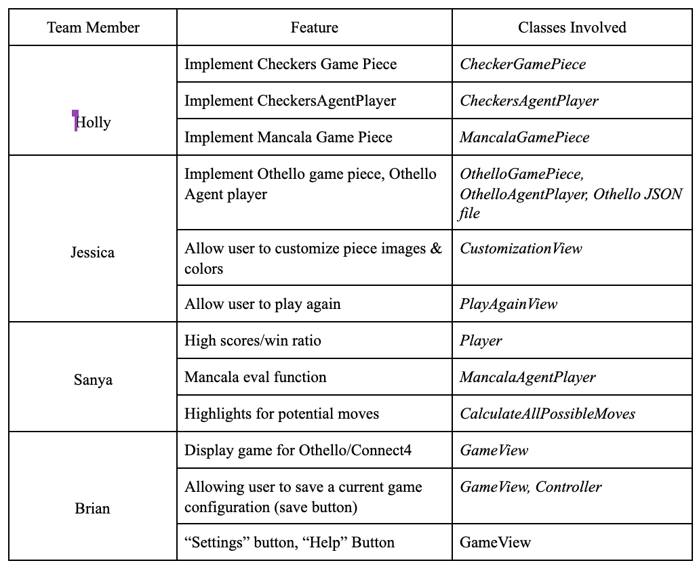
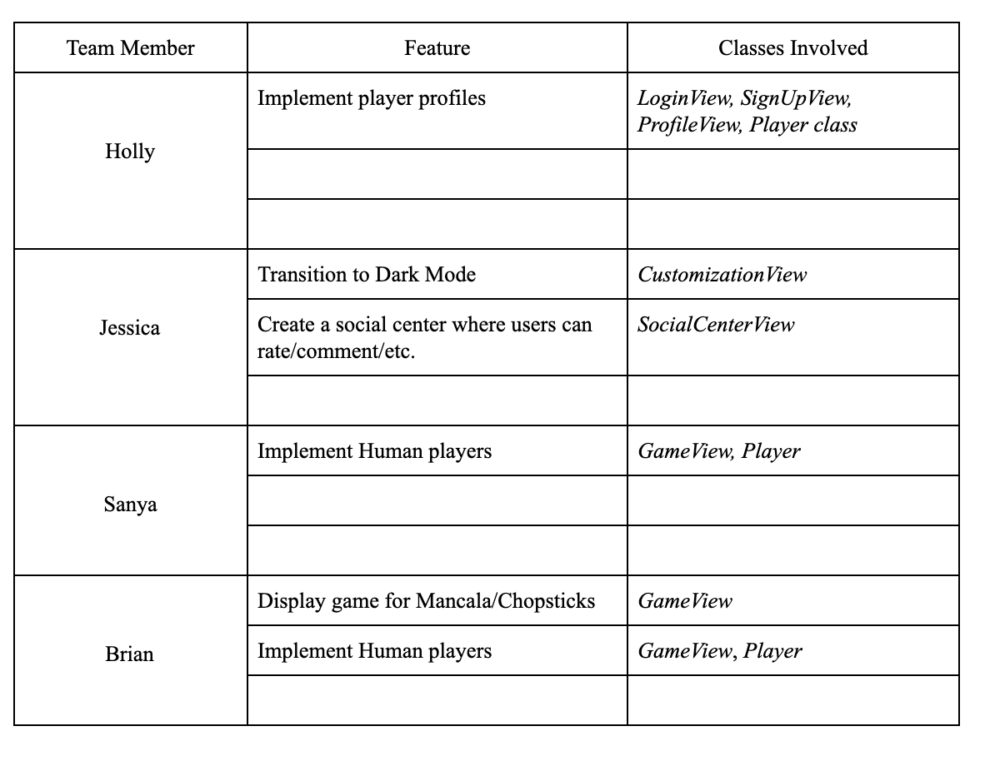
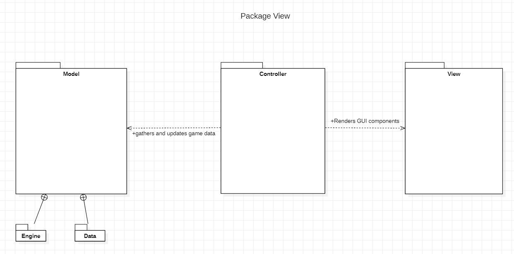

PRESENTATION PLAN
====
## **Implementation Plan**
* what genre or game are you focusing on and what commonalities and differences have you identified
    - We are developing a series of strategy games, namely Tic-Tac-Toe, Connect 4, Othello, Mancala, Checkers, and Chopsticks. 
    - (SANYA) commonalities:
     - **Turn based** → with movement & strategy
            - **2 players**
                - User player
                - Agent player (computer)
            - **Board based**
                - Size be defined by game type
            - **Game object** → where object belongs to player
                - Example: X or O for Tic-Tac-Toe, red/black piece for Checkers, black/white piece for Othello, etc.
            - **Game rules** dictate where a piece can move (ex. diagonally, horizontally, vertically, anywhere on board) and how a piece can affect its neighbors 
            - **Winning** based on having “more” than your opponent
                - Example: in Othello, having the most black pieces; in Connect 4, having 4 in a row first; etc. 

    - (BRIAN) differences:
    -  The main differences between the 6 strategy games is that Tic-Tac-Toe and Connect4 begin with an empty board configuration where game pieces are added while the other games
       begin with a specific configuration of game pieces. All games will also have a different default configuration and board dimensions.  
    -  In addition, the rules of each game are completely different. For example, in tic-tac-toe, gamepieces can be placed in any empty spot while in Connect 4, a gamepiece can only be placed if the spot below either contains a gamepiece or is the bottom of the board.
* (JESSICA) Who is expected to work on which parts of the project
    - The chart below shows how the APIs/classes will roughly be divided between all of us. The APIs are in bold, the classes in italics, and the extensions underlined. It’s important to note that this division of tasks is not rigid, meaning many of us will probably work on/refactor the same APIs at different points of the project even if it’s currently only listed under one person for now. 
     
* (JESSICA) what extensions you are expecting to work on
    - Tic Tac Toe 
    - Connect 4 
    - Checkers 
    - Othello 
    - Mancala
    - Chopsticks
* what features you expect to complete during each of the three Sprints
    - (JESSICA) **Sprint 1**: 
        - *Our primary goal of Sprint1 is to establish the foundations of our APIs (GameFramework, BoardFramework, FileHandler, GameViewFramework, ControllerFramework, and Player hierarchy) and make the back-end and view work together so that the user can play Tic-Tac-Toe.*
        
    - (BRIAN) **Sprint 2**: 
        - *The primary goal of Sprint 2 is to make 2-3 other extensions work based on the framework established by Tic-Tac-Toe (ex. Checkers, Othello, Connect4). Another goal of Sprint 2 is to add some user customization features, such as changing the color/image of game pieces, as well as user interaction features, such as allowing the user to play again and allowing the user to save a current game configuration.*
         
    - (HOLLY) **Sprint 3**: 
        - *The goal of Sprint 3 is to finish the rest of the extensions, as well as make the game more personal/customizable. For instance, we plan to add a profile feature, keep track of high scores, and allow the user to play against other users (rather than a computer).*
        
     
* (JESSICA) Demo the User Interface Wireframe to show how the user will interact with the program        
    **LOG-IN & SIGN UP**: Log-in for returning user, sign-up for new user. 
    
    
    
    **GAME CENTER**: *Choose a game by clicking on its name or enter a custom configuration in text box. Profile icon (top left) takes you to the PROFILE page, LogOut icon (top right) takes you to PLAYER REGISTRATION screen.*
    
    **PROFILE**: *Personal info (name, username, password), and the percent of games won for each game*. 
    
    
    
    **TIC TAC TOE GAME FLOW**: *Follow Tic-Tac-Toe rules. Will continue keeping track of games won as long as user continues selecting “yes” when prompted to play again. “No” → back to GAME CENTER.*
    
    
    
    **GAME CUSTOMIZATION**: *using Tic-Tac-Toe as example, but applies for EVERY game.*
     
    
    
    **CHECKERS GAME FLOW**: *Pieces outlined in YELLOW are pieces the player can move. A piece outlined in GREY is the piece the user has chosen to move. The outlined grey circles are the user’s POSSIBLE moves based on his/her selected piece.*
    
     
    
    **OTHELLO GAME FLOW**: *Grey outlines are where a new piece can be placed.*
    
    
    
    **CONNECT4 GAME FLOW**: *Grey arrow moved over column where player wants to drop new piece.*
    
    
    
    **MANCALA GAME FLOW**: *Click on a certain slot to pick up ALL pieces and distribute them one-by-one over next slots.*
    
    
    
    **CHOPSTICKS GAME FLOW**: *Press ADD to add another chopstick to your hand, press SELECT ALL and TAP to add your chopstick number to the opponent's hand/your other hand.*
    
    

    
## **Design Plan**
* (SANYA) describe the design and architecture goals: what is expected to be flexible/open and what is fixed/closed
  - The design is centered around supporting the existing games with closed game and board functionality, while 
its abstraction of game piece types makes it open to adding different types of strategy games. 
        - Examples of flexibility through APIS: 
            - FileHandler - allows flexibility in loading/saving configuration 
            - GamePiece - new types of strategy games 
            - GameViewFramework - framework to allow any view to update the appearance of a strategy game  

* (SANYA) provide an overview of the project's modules: what is each responsible for and how does it depend on other modules

    - **Model**
        - Game Engine
            - Game: an API responsible for holding the board and therefore keeping track of key gameplay information such as the winning status and player moves. Interacts with board and players to run the overall game. Passes lists of coordinates received either from the view (user case) or the agent to communicate piece moves on the board.
            - Board: API to hold all the game pieces and is responsible for changes in game piece states. Uses a Coordinate object to communicate moves.
            - Player: this abstract class will be used to create an agent player and potentially a user player, with a hierarchy to implement moves for each game.
            - Game Piece: an interface to be extended/implemented by each game to execute its particular game rules. It will be responsible for tracking a piece’s variables such as position, status and will help compute possible moves to be used by the agent player. 
        - File handler
            - This will read and parse the JSON files that provide game configuration details, piece states, board dimensions and other graphic features. It will provide functionality to SaveView to save the current game configuration.
    - **View**
        - StartView:
            - Creates the start screen to allow users to select a game. Includes functionality to load a saved game configuration
            - Creates controller and passes it to GameView
        - GameView
            - API that dictates in-game interactions, including buttons such as “play move”, “main menu”, “save”, “restart”, “settings”, “help”
            - Settings will create a customization view for a user to change viewing preferences
            - Save button will defer to SaveView
        - SaveView
            - Will generate a dialog to allow a user to save to file
        - CustomizationView
            - Allows a user to update preferences such as change piece colors, board colors, etc.
    - **Controller**
        - API to communicate between the view and the model. It will be communicating properties from the fileHandler to facilitate reactions on the view. Methods such as pieceSelected, squareSelected and playMove allow game piece movements occurring due to user input to occur on the backend. It tells the model when to generate an agent movement, and then communicates model reactions to the view.

* (HOLLY) describe two APIs in detail:
    - What service does it provide?
    - How does it provide for extension?
    - How does it support users (your team mates) to write readable, well design code?

* (BRIAN) describe two use cases in detail that show off how to use one or more of the APIs described previously

* (SANYA) describe one alternative design considered and what trade-offs led to it not being chosen
  - *How to calculate specific neighbors for different games:* 
        - This consideration is one that has made us reconsider whether to keep the board common across all games or specific to each game. Each game has different requirements in terms of which neighbors it needs to know. For example, placing a piece in Checkers requires knowledge of all the adjacent pieces that piece could potentially skip over. Chopsticks needs to know the positions of all of its own pieces. The board has knowledge of all the piece positions, which would make it the likely candidate to provide this information, but it would also make our design less general. We have chosen not to include this method in the board because it would force us to create a board hierarchy.

