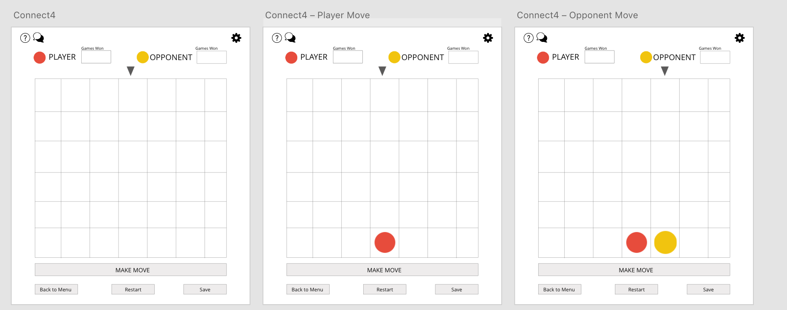
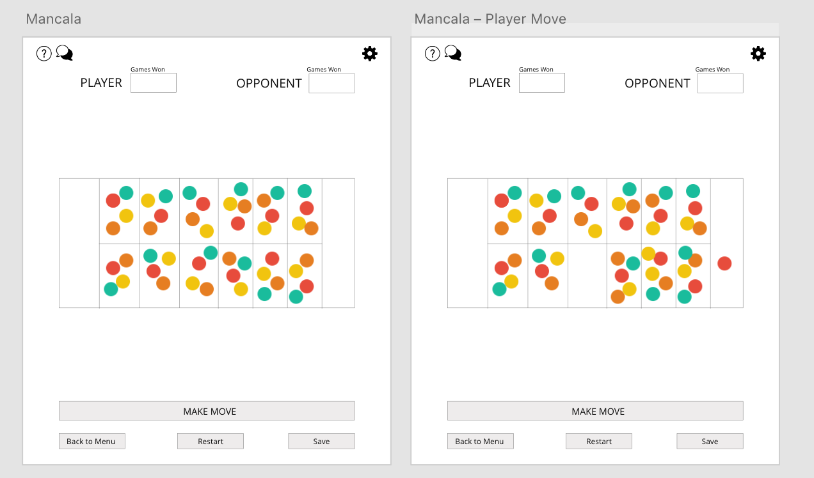

PRESENTATION PLAN
====
## **Implementation Plan**
* what genre or game are you focusing on and what commonalities and differences have you identified
    - (SANYA) commonalities 
    - (BRIAN) differences 
* (JESSICA) Who is expected to work on which parts of the project
    - The chart below shows how the APIs/classes will roughly be divided between all of us. The APIs are in bold, the classes in italics, and the extensions underlined. It’s important to note that this division of tasks is not rigid, meaning many of us will probably work on/refactor the same APIs at different points of the project even if it’s currently only listed under one person for now.
     
* (JESSICA) what extensions you are expecting to work on
    - Tic Tac Toe 
    - Connect 4 
    - Checkers 
    - Othello 
    - Mancala
    - Chopsticks
* what features you expect to complete during each of the three Sprints
    - (JESSICA) **Sprint 1**: 
        - *Our primary goal of Sprint1 is to establish the foundations of our APIs (GameFramework, BoardFramework, FileHandler, GameViewFramework, ControllerFramework, and Player hierarchy) and make the back-end and view work together so that the user can play Tic-Tac-Toe.*
        
    - (BRIAN) **Sprint 2**: 
        - *The primary goal of Sprint 2 is to make 2-3 other extensions work based on the framework established by Tic-Tac-Toe (ex. Checkers, Othello, Connect4). Another goal of Sprint 2 is to add some user customization features, such as changing the color/image of game pieces, as well as user interaction features, such as allowing the user to play again and allowing the user to save a current game configuration.*
         
    - (HOLLY) **Sprint 3**: 
        - *The goal of Sprint 3 is to finish the rest of the extensions, as well as make the game more personal/customizable. For instance, we plan to add a profile feature, keep track of high scores, and allow the user to play against other users (rather than a computer).*
        
     
* (JESSICA) Demo the User Interface Wireframe to show how the user will interact with the program        
    **LOG-IN & SIGN UP**: Log-in for returning user, sign-up for new user. 
    
    
    
    **GAME CENTER**: *Choose a game by clicking on its name or enter a custom configuration in text box. Profile icon (top left) takes you to the PROFILE page, LogOut icon (top right) takes you to PLAYER REGISTRATION screen.*
    
    **PROFILE**: *Personal info (name, username, password), and the percent of games won for each game*. 
    
    
    
    **TIC TAC TOE GAME FLOW**: *Follow Tic-Tac-Toe rules. Will continue keeping track of games won as long as user continues selecting “yes” when prompted to play again. “No” → back to GAME CENTER.*
    
    
    
    **GAME CUSTOMIZATION**: *using Tic-Tac-Toe as example, but applies for EVERY game.*
     
    
    
    **CHECKERS GAME FLOW**: *Pieces outlined in YELLOW are pieces the player can move. A piece outlined in GREY is the piece the user has chosen to move. The outlined grey circles are the user’s POSSIBLE moves based on his/her selected piece.*
    
     
    
    **OTHELLO GAME FLOW**: *Grey outlines are where a new piece can be placed.*
    
    
    
    **CONNECT4 GAME FLOW**: *Grey arrow moved over column where player wants to drop new piece.*
    
    
    
    **MANCALA GAME FLOW**: *Click on a certain slot to pick up ALL pieces and distribute them one-by-one over next slots.*
    
    
    
    **CHOPSTICKS GAME FLOW**: *Press ADD to add another chopstick to your hand, press SELECT ALL and TAP to add your chopstick number to the opponent's hand/your other hand.*
    
    

    
## **Design Plan**
* (SANYA) describe the design and architecture goals: what is expected to be flexible/open and what is fixed/closed

* (SANYA) provide an overview of the project's modules: what is each responsible for and how does it depend on other modules

* (HOLLY) describe two APIs in detail:
    - What service does it provide?
    - How does it provide for extension?
    - How does it support users (your team mates) to write readable, well design code?

* (BRIAN) describe two use cases in detail that show off how to use one or more of the APIs described previously

* (SANYA) describe one alternative design considered and what trade-offs led to it not being chosen

