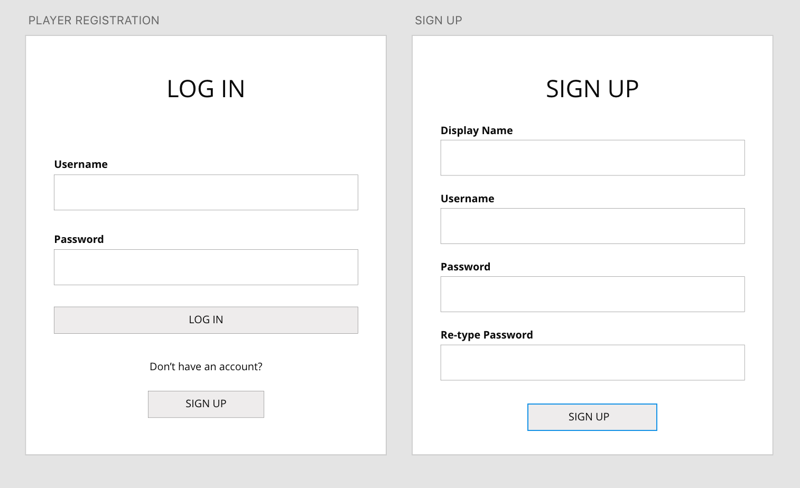
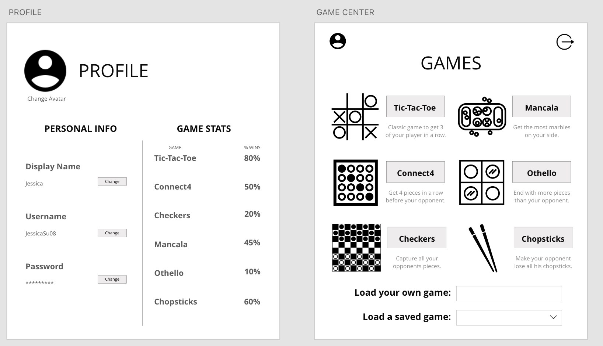
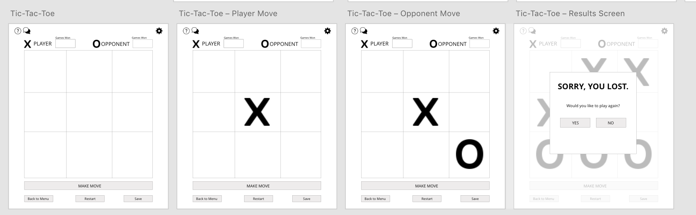
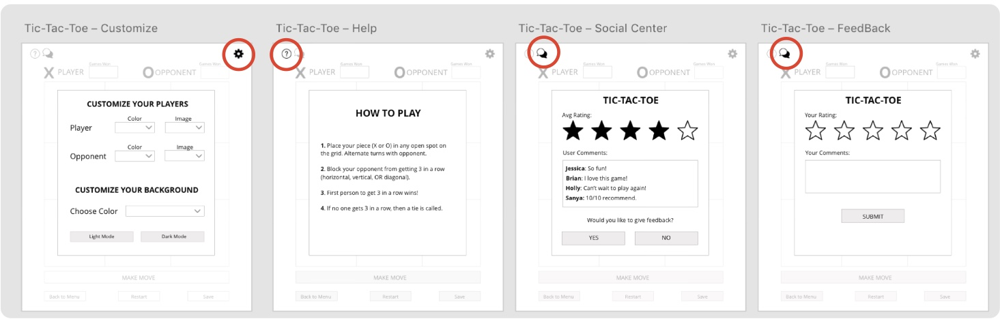
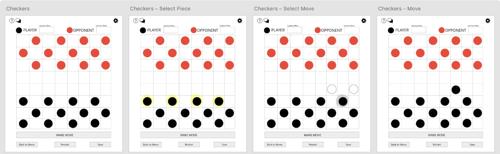
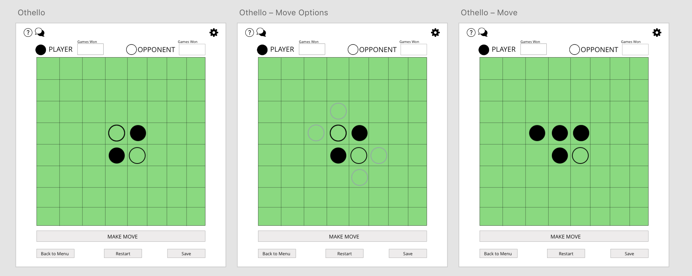
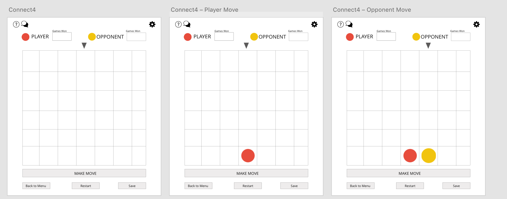
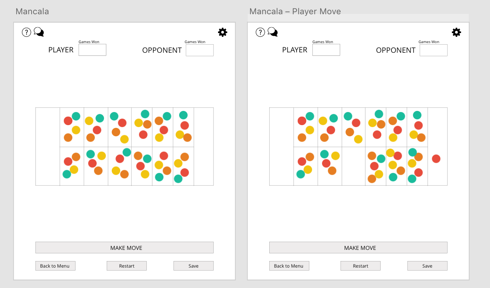
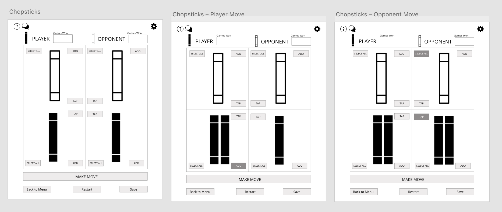

WIREFRAMES
====

This is the [link](https://xd.adobe.com/view/81d1e43d-a572-4be8-5562-6bb464218ad3-f7e0/) to the AdobeXD document that contains the wireframes for our project. 

Here are also screenshots taken from the AdobeXD document and descriptions to show the overall flow for user interactions in our GUI. 

**LOG-IN & SIGN UP**: Log-in for returning user, sign-up for new user. 

**GAME CENTER**: *Choose a game by clicking on its name or enter a custom configuration in text box. Profile icon (top left) takes you to the PROFILE page, LogOut icon (top right) takes you to PLAYER REGISTRATION screen.*

**PROFILE**: *Personal info (name, username, password), and # games won for each game*. 

**TIC TAC TOE GAME FLOW**: *Follow Tic-Tac-Toe rules. Will continue keeping track of games won as long as user continues selecting “yes” when prompted to play again. “No” → back to GAME CENTER.*

**GAME CUSTOMIZATION**: *using Tic-Tac-Toe as example, but applies for EVERY game.*
 

**CHECKERS GAME FLOW**: *Pieces outlined in YELLOW are pieces the player can move. A piece outlined in GREY is the piece the user has chosen to move. The outlined grey circles are the user’s POSSIBLE moves based on his/her selected piece.*

 

**OTHELLO GAME FLOW**: *Grey outlines are where a new piece can be placed.*

**CONNECT4 GAME FLOW**: *Grey arrow moved over column where player wants to drop new piece.*

**MANCALA GAME FLOW**: *Click on a certain slot to pick up ALL pieces and distribute them one-by-one over next slots.*

**CHOPSTICKS GAME FLOW**: *Press ADD to add another chopstick to your hand, press SELECT ALL and TAP to add your chopstick number to the opponent's hand/your other hand.*

 

 

