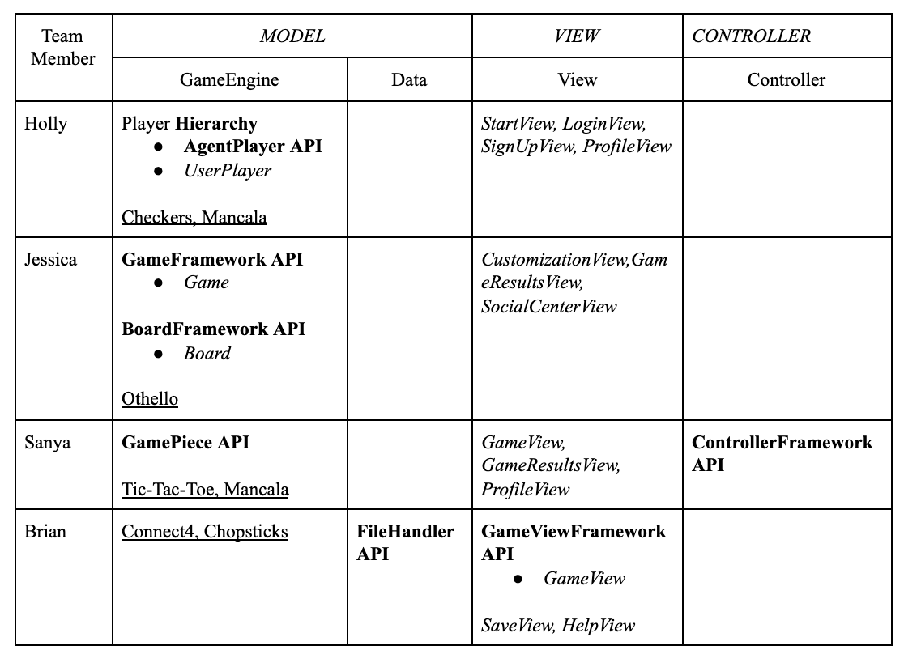
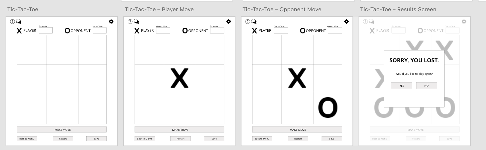
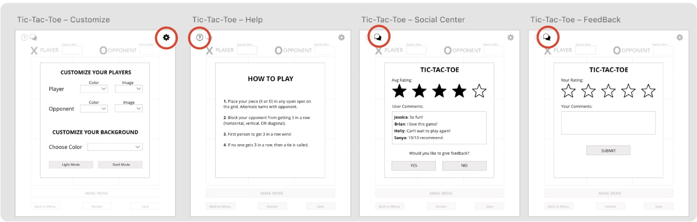
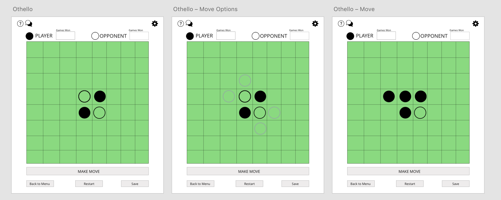
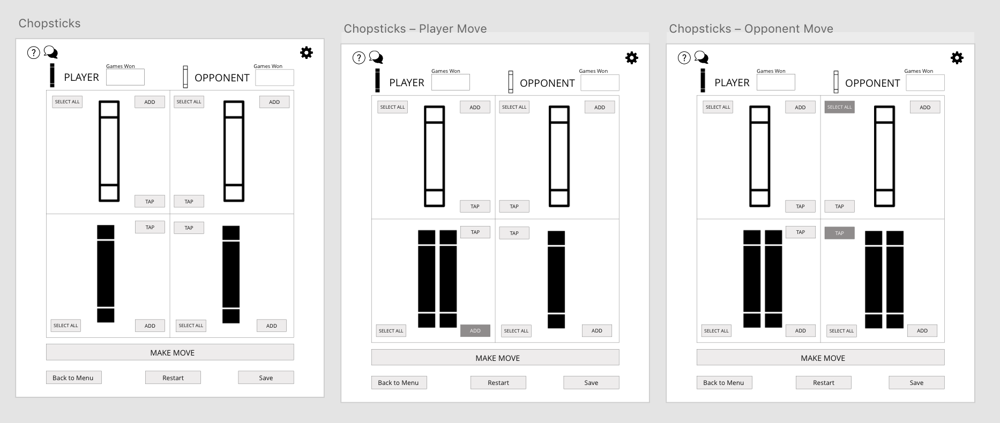

PRESENTATION PLAN
====
## **Implementation Plan**
* what genre or game are you focusing on and what commonalities and differences have you identified
    - (SANYA) commonalities 
    - (BRIAN) differences 
* (JESSICA) Who is expected to work on which parts of the project
    - The chart below shows how the APIs/classes will roughly be divided between all of us. The APIs are in bold, the classes in italics, and the extensions underlined. It’s important to note that this division of tasks is not rigid, meaning many of us will probably work on/refactor the same APIs at different points of the project even if it’s currently only listed under one person for now.
     
* (JESSICA) what extensions you are expecting to work on
    - Tic Tac Toe 
    - Connect 4 
    - Checkers 
    - Othello 
    - Mancala
    - Chopsticks
* what features you expect to complete during each of the three Sprints
    - (JESSICA) **Sprint 1**: 
        - *Our primary goal of Sprint1 is to establish the foundations of our APIs (GameFramework, BoardFramework, FileHandler, GameViewFramework, ControllerFramework, and Player hierarchy) and make the back-end and view work together so that the user can play Tic-Tac-Toe.*
        
    - (BRIAN) **Sprint 2**: 
        - *The primary goal of Sprint 2 is to make 2-3 other extensions work based on the framework established by Tic-Tac-Toe (ex. Checkers, Othello, Connect4). Another goal of Sprint 2 is to add some user customization features, such as changing the color/image of game pieces, as well as user interaction features, such as allowing the user to play again and allowing the user to save a current game configuration.*
         
    - (HOLLY) **Sprint 3**: 
        - *The goal of Sprint 3 is to finish the rest of the extensions, as well as make the game more personal/customizable. For instance, we plan to add a profile feature, keep track of high scores, and allow the user to play against other users (rather than a computer).*
        
     
* (JESSICA) Demo the User Interface Wireframe to show how the user will interact with the program        
    **LOG-IN & SIGN UP**: Log-in for returning user, sign-up for new user. 
    
    
    
    **GAME CENTER**: *Choose a game by clicking on its name or enter a custom configuration in text box. Profile icon (top left) takes you to the PROFILE page, LogOut icon (top right) takes you to PLAYER REGISTRATION screen.*
    
    **PROFILE**: *Personal info (name, username, password), and the percent of games won for each game*. 
    
    
    
    **TIC TAC TOE GAME FLOW**: *Follow Tic-Tac-Toe rules. Will continue keeping track of games won as long as user continues selecting “yes” when prompted to play again. “No” → back to GAME CENTER.*
    
    
    
    **GAME CUSTOMIZATION**: *using Tic-Tac-Toe as example, but applies for EVERY game.*
     
    
    
    **CHECKERS GAME FLOW**: *Pieces outlined in YELLOW are pieces the player can move. A piece outlined in GREY is the piece the user has chosen to move. The outlined grey circles are the user’s POSSIBLE moves based on his/her selected piece.*
    
     
    
    **OTHELLO GAME FLOW**: *Grey outlines are where a new piece can be placed.*
    
    
    
    **CONNECT4 GAME FLOW**: *Grey arrow moved over column where player wants to drop new piece.*
    
    
    
    **MANCALA GAME FLOW**: *Click on a certain slot to pick up ALL pieces and distribute them one-by-one over next slots.*
    
    
    
    **CHOPSTICKS GAME FLOW**: *Press ADD to add another chopstick to your hand, press SELECT ALL and TAP to add your chopstick number to the opponent's hand/your other hand.*
    
    

    
## **Design Plan**
* (SANYA) describe the design and architecture goals: what is expected to be flexible/open and what is fixed/closed

* (SANYA) provide an overview of the project's modules: what is each responsible for and how does it depend on other modules

* (HOLLY) describe two APIs in detail:
    - What service does it provide?
    - How does it provide for extension?
    - How does it support users (your team mates) to write readable, well design code?

  1.) GamePiece API
    * Service it provides:
        * At a high level, this API provides the ability for pieces to act according to certain game rules. It is what calculates which ways a piece can move that are valid and it also then implements the move with the effects specified by the game rules. 
        * At a lower level, this API is what validates the moves indicated by the user and then makes them which changes the game state based on the move. It also gives all the possible moves of a piece so that the AI agent can determine a move by considering only the moves it is allowed to make.
    * How it provides for extension:
        * This API provides for extension because it is very simple to create a new type of GamePiece. The new extension would just need to implement the two methods in the interface based on the rules for the extension you would like to implement. So it helps to easily allow the program to accommodate more game types and variations.
    * How it supports readable and well designed code:
        * Firstly, this API supports the writing of readable code because it is well commented and the methods are well-named, so it will allow users to understand what is supposed to happen in the methods and directing the focus of the code that they write.
            * Additionally, the use of the coordinate object helps to make the code more readable because there are not as many integers to keep track of
        * It supports the writing of well-designed code because it encapsulates the differences amongst game types. Outside of the GamePiece hierarchy, the rest of the board acts on all game pieces the same way because sub-classes are forced to implement the methods specified in the interface.
        * Additionally, the API shows the functionality that a GamePiece has which is finding and making moves. This supports well-designed code because it will follow the Single Responsibility principle since its only responsibility is the game moves.
        
  2.) FileHandler API
    * Service it provides:
        * This API provides the ability to read and parse a file as well as save a new one that is customized based on what the user wants.
    * How it provides for extension:
        * This API provides for extension because it gives the flexibility to easily extend the program to be able to take in multiple different types of files.
    * How it supports readable and well designed code:
        * It supports the writing of well designed code because it help to ensure that other parts of the code are following the Single Responsibility Principle because this API separates all of the logic dealing with files, so no other part of the code has to. 
            * And similarly it encapsulates the formatting of the data files to the rest of the program.
        * Similar to the GamePiece API, because of the well named methods and comments this code can help code written in other parts of the program be more readable because the FileHandler method names make it clear what is happening.
* (BRIAN) describe two use cases in detail that show off how to use one or more of the APIs described previously

* (SANYA) describe one alternative design considered and what trade-offs led to it not being chosen

