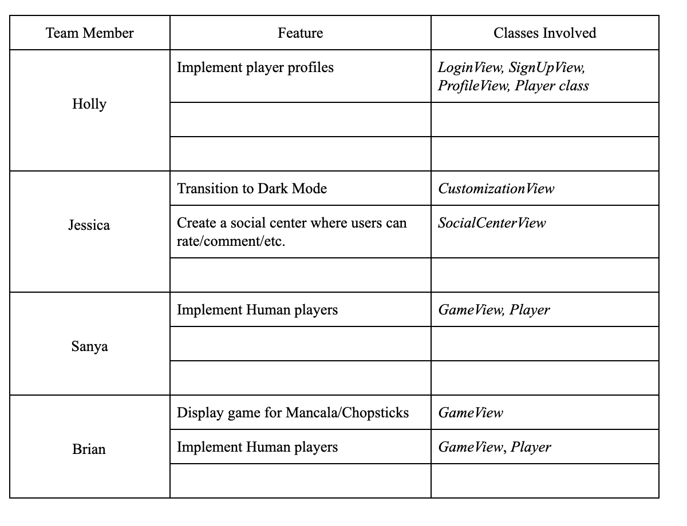

Demo Order:

* Start by showing off the features of your running program:
1. run the program through a planned series of steps/interactions (it will look much better if it this demo shows everyone's parts working together as a single program rather than multiple separate demos)
    * Demo Order:
        1. Start View (Holly)
            * Have added Connect4, Checkers, and Othello 
            * Also have the functionality to load a data file either by typing or from drop down
        2. Tic-Tac-Toe (Sanya) 
            * Now have a pop-up that shows the end results 
                * can restart, go to main menu, or go to set up 
            * Track player and opponent wins as long as user continues restarting game 
        3. Othello (Jessica) 
            * Possible moves are highlighted in grey 
            * Othello rules & Othello agent 
            * Customization View 
                * can choose board colors & player/opponent images 
        4. Connect 4 (Brian) 
            * Connect 4 rules 
            * How connect 4 agent works 
            * Restart, Main Menu, Setup, Save buttons 
            * Rules button 
        5. Checkers (Holly)
            * Show Checkers rules 
            * Discuss how Checkers AI agent works 
    
    * show any data files that have been created and describe how they are used within your program (focus on the file content rather than the code that uses it)
        1. Checkers (Holly)
            * Special state/image, direction, etc. 
        2. Customization JSON (Jessica) 
            * Talk about how the key is the name of the button and the value is the method name 
            * Reflection 
        3. EndView (Sanya)
            * Also associates button names and actions for reflection 
    * show a variety of JUnit or TestFX tests (including both happy and sad paths) and discuss how comprehensively they cover the feature(s) and why you chose the values used in the tests
        * Show overall test coverage
        * How writing tests helped → Brian 
            * helped us know that we could rely on components our teammates wrote without needing to check them 
            * also helped us make sure our own code was working correctly and catch bugs 
    * everyone should be able to describe how their work relates to specific demoed features as they are shown
        * see demo order above - each person talking implemented the feature 
* Then present what you (or your team overall) learned during this Sprint and the implementation plan for the next Sprint:
    * describe how much of the planned features were completed this Sprint and what helped or impeded progress → Holly
        * All of features planned were completed
            * Still some room for feature enhancement 
        * What helped/impeded progress 
            * Same as last time - constant zoom meetings (at least once-twice a week), responsiveness on FB messenger, quick to offer help if needed 
            * Also we realized that our program design made it relatively easy to add new games 
            * Data-driven design - a lot of the small differences between games are listed in the config file 
                * It was challenging to figure out how to communicate all the information from the config to our board/game piece instead of having 10+ parameters 
    * describe a specific significant event that occurred this Sprint and what was learned from it → Jessica
        * Significant event  = ability to integrate multiple games with our framework 
            * we only did tic tac toe last week, but this sprint, we were able to make 3 more games in the same amount of time 
            * showed that our framework was flexible enough to add other strategy games 
    * describe what worked, what did not, and something specific that is planned for improvement next Sprint → Sanya
        * What worked
            * Very detailed planning & specific delegation of tasks (use of Git issue board) 
            * Constant communication 
        * What did not
            * Think this sprint went pretty well? 
        * Improvement
            * Start the sprint off with a code review 
            * Before implementing new features, we plan to look over current code to improve design 
    * what features are planned to be completed during the next Sprint (taking into account what was done this Sprint), who will work on each feature, and any concerns that may complicate the plan → Brian
        * On track for next sprint because we completed all features for sprint 2 
        * Still have room for refactoring classes & cleaning code 
        *  